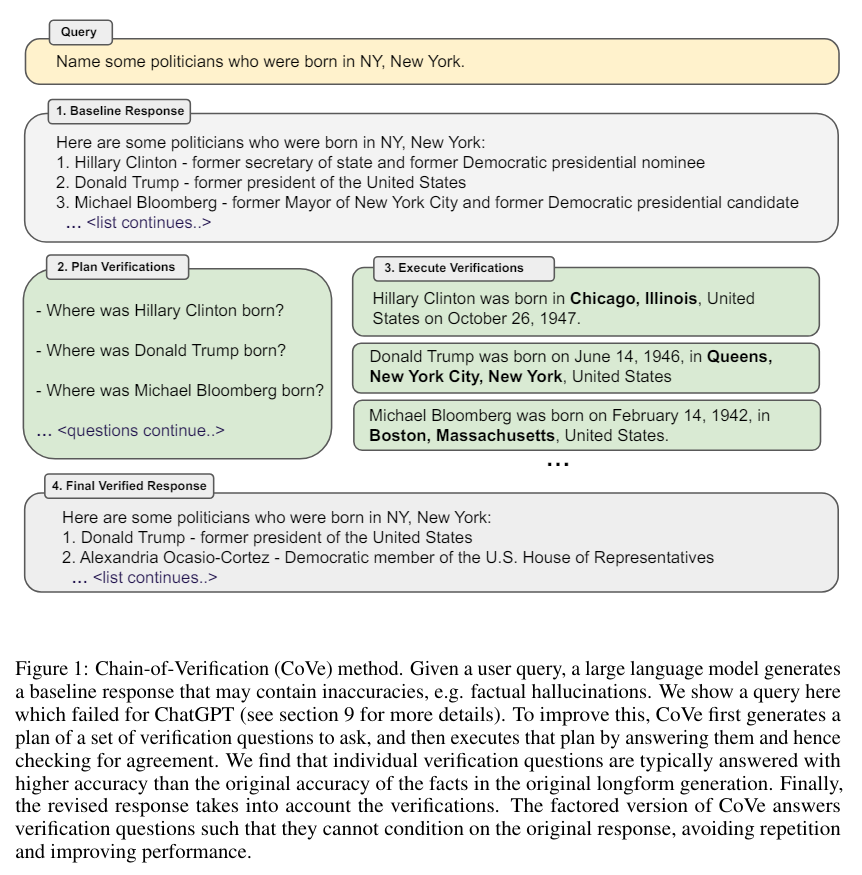

# Chain Of Verification (CoVe):
# Chain-of-Verification Reduces Hallucination in Large Language Models 

The paper addresses the problem of hallucinations in large language models (LLMs) by introducing the Chain-of-Verification (CoVe) method. 

Paper link: https://arxiv.org/abs/2309.11495

## 👉 The overall process of CoVe performs 4 steps:

1. Generate Baseline Response: Given a query, generate the initial response using the LLM. 

2. Plan Verifications: Given both query and baseline response, generate a list of verification questions that could help to self-analyze if there are any mistakes in the original response. 

3. Execute Verifications: Answer each verification question in turn, and hence check the answer against the original response to check for inconsistencies or mistakes. 

4. Generate Final Verified Response: Given the discovered inconsistencies (if any), generate a revised response incorporating the verification results. 

The process ensures independent verification to avoid biases and repeated mistakes.

It requires the use of a single LLM, without the multi-agent (multi-LLM) debate concept.
No finetuning or pre-training needed.

## 👉 The authors investigated further (4) approaches for the step 3:

1. Joint: Step 2 and 3 are performed using a single prompt, using few-shot examples where both verifications questions and their answers are included immediately after the questions.
The initial response is also included in the single prompt. 

⇒ drawbacks: Since verification questions rely on the initial response, the answers may also depend on it, leading to repeated errors or hallucinations.

2. Two-step: Separates planning and execution, both with their own prompt:
- In the first step, verification questions are generated based on the initial response. 
- In the second step, these questions are answered without referencing the original response, it contains only the question
⇒ reducing the risk of repeating mistakes.

4. Factored: Answer all verification questions independently as separate prompts that don’t reference the original response.
This prevents copying errors and interference between answers. 
Although it requires more computational resources, it can handle more questions since they don't need to fit into one context
Questions are parsed into separate prompts for parallel processing, making the method efficient despite its complexity.

5. Factor + revise: Additional step after answering verification questions. 
Explicitly checks for inconsistencies between the original response and the verification answers. 
Each verification question and answer is cross-checked against the original response using separate prompts, which helps the system identify and reason about any inconsistencies.

For example, if the original response mentioned an event after 1845, but a verification question answered it as 1836, this step would detect the inconsistency.

⇒ Factored and factor+revise approaches showed the best performance, particularly in reducing repeated hallucinations.

## 👉Various tasks evaluated:
1. List-based questions (Wikidata, Wikipedia Category list)

“Who are some politicians who were born in Boston?”

2. Closed book QA (MultiSpanQA)

“Q: Who invented the first printing press and in what year?, A: Johannes Gutenberg, 1450.”

3. Longform text generation of biographies

## 👉 Evaluated LLMs evaluated:
Different LLMs have been evaluated (depending on the task):
LLama 65B, Llama 2 70B Chat, ChatGPT, InstructGPT, PerplexityAI. Alongside different prompt techniques: Zero-Shot CoT, CoT, Few-shot, CoVe and its  verification execution variants.

Results:
The method consistently reduced hallucinations and improved accuracy across all tasks compared to baseline models.
